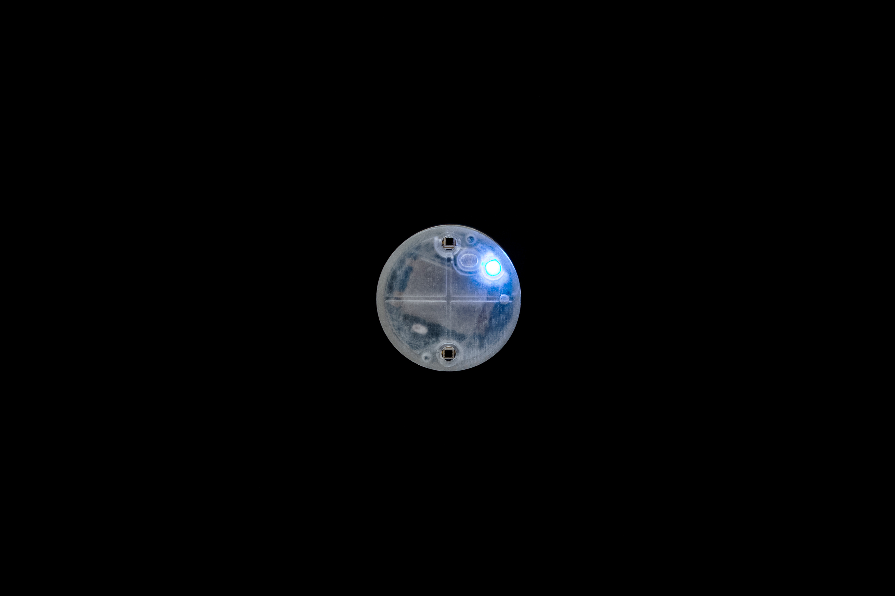
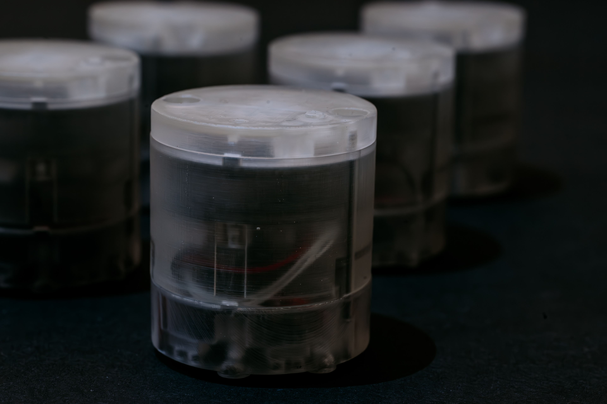
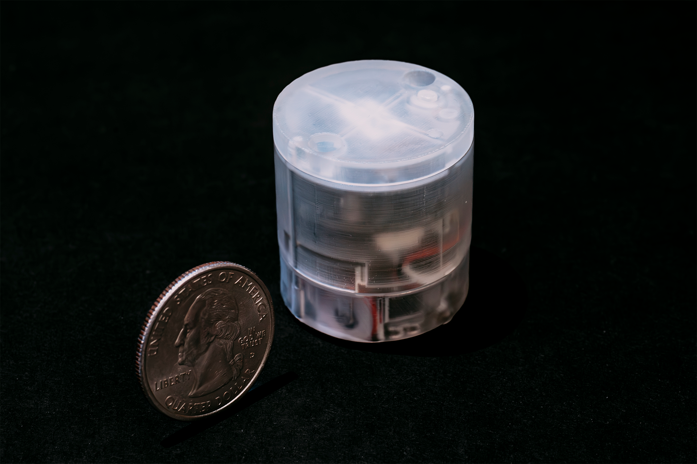
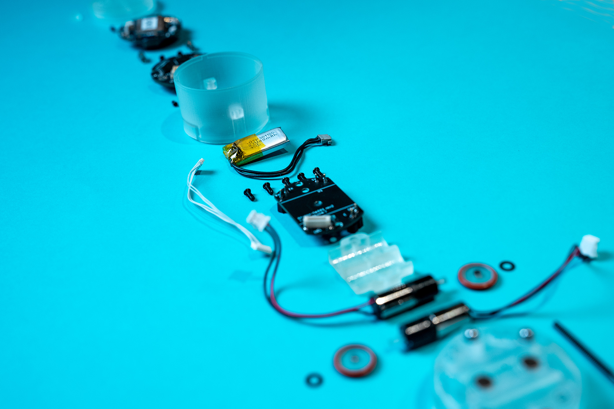
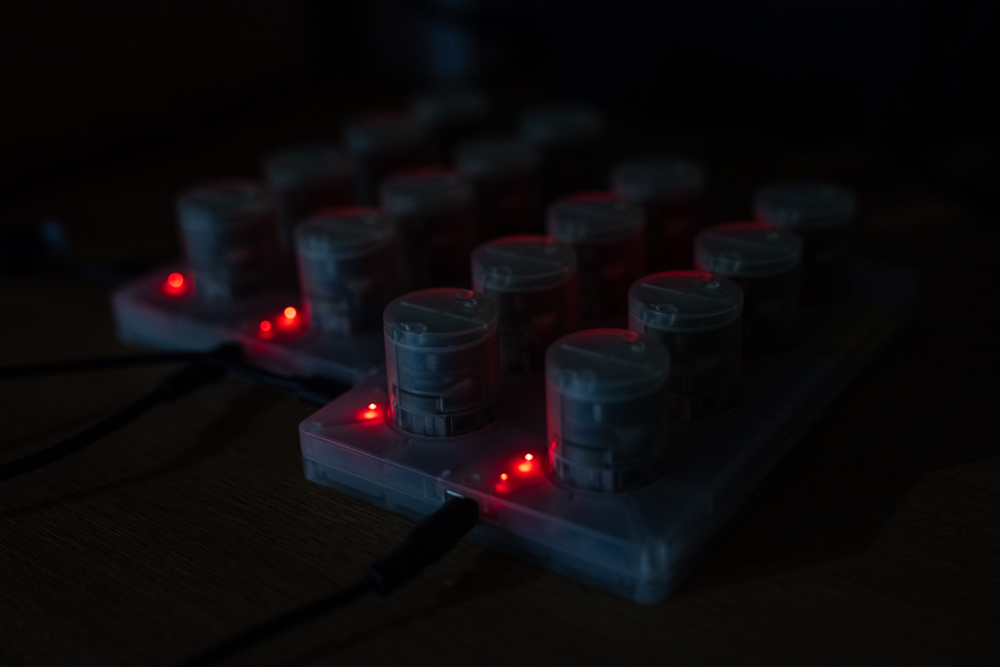

# maru: a miniature-sized wheeled robot for swarm robotics research



"maru" (= *miniature assemblage adaptive robot unit*) is a custom-made, miniature-sized, two-wheeled robot designed specifically for tabletop swarm robotics research.
This platform enables researchers and hobbyists to explore the dynamics of swarm robotics in a controlled, tabletop environment.




This repository serves as a comprehensive resource for assembling and operating maru, providing detailed documentation and files, including:

- `hardware/3Dmodel` 3D models of the robot and its cradle (a combined communication and charging module),
- `hardware/circuit/schematic` Circuit schematics to guide the electronic assembly,
- `hardware/circuit/gerber` Gerber files for PCB manufacturing,
- `software/firmware` Firmware for both the robot and the cradle, distributed in binary format (Note: There are currently no plans to release the source code),
- `software/control` APIs and sample codes to help you get started with programming the robot for various tasks and behaviors (C# and Python).

This project draws inspiration from [Zooids](https://github.com/ShapeLab/SwarmUI), an open-source swarm robot platform.
Similar to Zooids, maru employs projection-based position tracking; however both maru's hardware and software are entirely new designs, another platform for swarm robotics research in HCI.

## Hardware
<!--  -->


The hardware design is shown above.
The dimensions are 30 mm in diameter and 34 mm in height, weighing about 23 g.
The robot parts include a microcontroller unit (STM32G071KBU62 from STMicroelectronics), motor drivers (DRV8837DSGR3 from Texas Instruments), RF module (RF2401F204 from NiceRF), motors with a 26:1 planetary gearbox (Pololu 23575), photodiode (PD15-22C/TR86 from Everlight Electronics), and a Li-Po battery (80mAh).

Since the robot is lightweight, the robot may fall over while moving if the moving speed is too fast.
Magnets can be attached to the bottom of the robot, and the robot can be run on steel or other materials to keep it from falling over.

A detailed description of the hardware design and specifications is available [here](https://shigeodayo.notion.site/Hardware-Manual-8442a3ade0ba457dba1eb5f8b898ae2d?pvs=4).



## Software


The communication between the robots and the host computer is shown above.
The robots and the cradles (charging station + RF/IO dongle) are each equipped with an RF module and communicate through a 2.4GHz ISM band wireless communication.
The user does not need to be aware of the communication control between the robot and the cradles, as it is performed on the firmware of both devices.
The user can easily control the robot wirelessly by sending the specified commands.

A detailed description of the software design and specifications is available [here](https://shigeodayo.notion.site/Software-Manual-53adfd3b5a8c482b9a2acadc83991381?pvs=4).


## Projection-based Localization

The maru system supports two types of projection-based localization methods: the *Zooids-based* method and *Pixel-level Visible Light Communication (PVLC)* [1] based method. Both methods employ a high-speed projector (DLP LightCrafter 4500 from Texas Instruments) to embed position-encoded patterns into projected images. The two photodiodes on each robot receive the projected coded-pattern light, and the robot’s microcontroller decodes these patterns into position information. Subsequently, the robot calculates its orientation from the positions of the two photodiodes and broadcasts its position and orientation information to the host computer. The details of each method are described below.

[Zooids-based Method]
This method projects a sequence of gray-coded patterns independently. A single white image is projected, allowing the projector to be used as an illumination source. For details on this localization method and setup instructions, please refer to [Zooids documentation](https://github.com/ShapeLab/SwarmUI/tree/master/Hardware/Projector%20Tracking%20Setup).

[PVLC-based Method]
This method embeds a sequence of gray-coded patterns into video content for projection. By properly configuring the data sent to the projector, visual content can be projected while maintaining localization capabilities. For detailed information on this localization method, please refer to the paper [2].

1. Sho Kimura, Ryo Oguchi, Hideo Tanida, Yasuaki Kakehi, Keita Takahashi, and Takeshi Naemura: “PVLC Projector: Image Projection with Imperceptible Pixel-Level Metadata,” ACM SIGGRAPH2008 Posters, p. 135:1, 2008.8.
2. Takefumi Hiraki, Shogo Fukushima, Yoshihiro Kawahara, and Takeshi Naemura, “Phygital Field: An Integrated Field with Physical Robots and Digital Images using Projection-based Localization and Control Method,” SICE Journal of Control, Measurement, and System Integration, vol. 11, no. 4, pp. 302–311, 2018.7.




## Note

This is a joint work between [OMRON SINIC X Corporation](https://www.omron.com/sinicx/), [Cluster Metaverse Lab](https://lab.cluster.mu/en/), and [karakuri products, inc](https://krkrpro.com).

If you prefer purchasing pre-assembled robots instead of assembling them yourself, please contact [karakuri products, inc](https://krkrpro.com).

## Lisence

The software materials of this project are under an MIT license.

The hardware materials of this project are under a [Creative Commons Attribution 4.0 International License](https://creativecommons.org/licenses/by/4.0/).


## Paper
This robot was first introduced and used in the following paper:


Sosuke Ichihashi, So Kuroki, Mai Nishimura, Kazumi Kasaura, Takefumi Hiraki, Kazutoshi Tanaka, and Shigeo Yoshida. 2024. Swarm Body: Embodied Swarm Robots. In Proceedings of the CHI Conference on Human Factors in Computing Systems (CHI ’24), May 11–16, 2024, Honolulu, HI, USA. ACM, New York, NY, USA, 19 pages. https://doi.org/10.1145/3613904.3642870


```
@inproceedings{ichihashi2024swarm,
  author = {Ichihashi, Sosuke and Kuroki, So and Nishimura, Mai and Kasaura, Kazumi and Hiraki, Takefumi and Tanaka, Kazutoshi and Yoshida, Shigeo},
  title = {Swarm Body: Embodied Swarm Robots},
  year = {2024},
  publisher = {Association for Computing Machinery},
  address = {New York, NY, USA},
  url = {[https://doi.org/10.1145/3613904.3642870](https://doi.org/10.1145/3613904.3642870)},
  doi = {10.1145/3613904.3642870},
  booktitle = {Proceedings of the 2024 CHI Conference on Human Factors in Computing Systems},
  numpages = {19},
  location = {, Honolulu, HI, USA, },
  series = {CHI '24}
}
```
